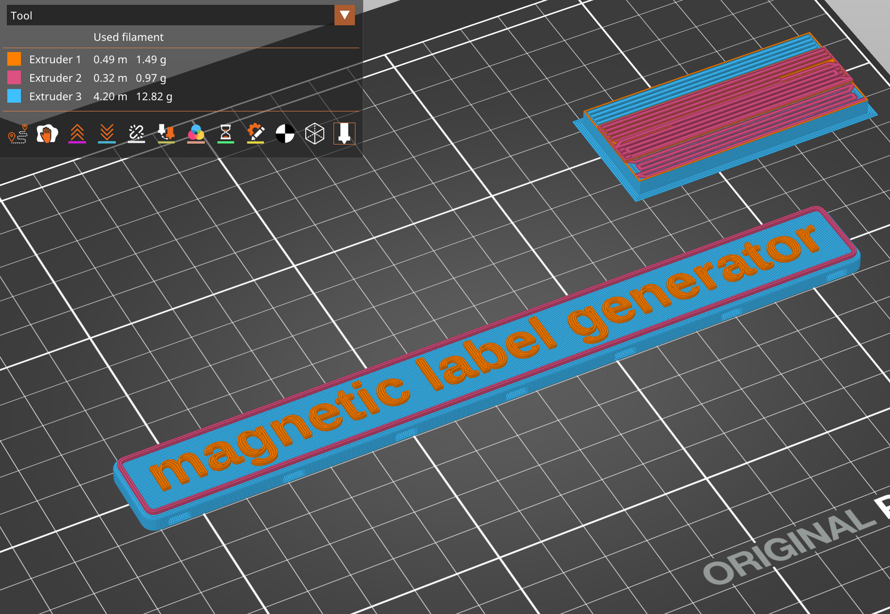

# Magnetic Label Generator



I need a bunch of magnetic labels for a steel toolbox. I chose to play around with openscad instead of building each label individually with a more traditional CAD tool.

As of June 2025, you'll need a development release of openscad (I'm using `2025.06.21`).

```bash
openscad --enable lazy-union --enable textmetrics \
-D'labeltext="magnetic label generator"' \
-D'bordercolor="blue"' \
-D'bordercolor="white"' \
-o path/to/output_file.3mf \
magnet_label.scad
```

This produces a 3D-Printable label with pockets to fit 10mm x 5mm x 2mm rare earth magnets. The 3MF format allows multi-part objects that your slicing software can print in different colors.
